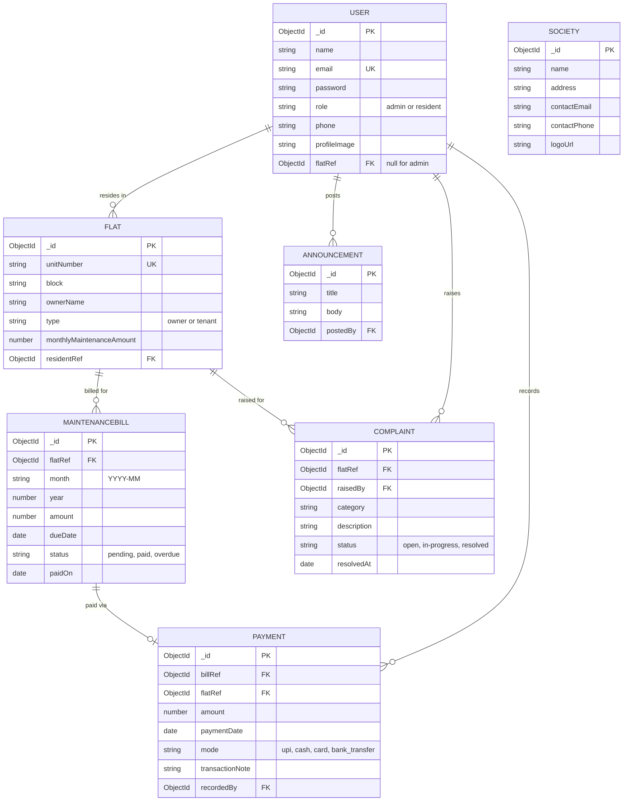

# Database Schema & ER Diagram

SMMS uses MongoDB with Mongoose. Below is the entity-relationship diagram followed by a description of each collection and the key business rules enforced at the schema level.

## ER Diagram

## Collection Details

### User
Stores both admin and resident accounts in one collection, distinguished by `role`. Passwords are hashed with bcrypt before saving (via a Mongoose pre-save hook) and are stripped out of any JSON response (`toJSON` override), so a password hash is never accidentally returned by the API. Residents have a `flatRef` pointing to their flat; admins have `flatRef: null`.

### Flat
Represents one unit in the society. `unitNumber` is unique. `residentRef` links back to the User occupying it — this is nullable, since a flat can exist before a resident is linked (e.g. newly built/vacant units).

### MaintenanceBill
The core billing record. **Key business rule:** a compound unique index on `(flatRef, month)` makes it impossible for two bills to exist for the same flat in the same month — enforced by MongoDB itself, not just application code. `status` starts as `pending` and transitions to `paid` (via a Payment) or `overdue` (automatically, when read past the due date — see the "check-on-read" pattern in `utils/overdueChecker.js`).

### Payment
Records an actual payment against a bill. Recording a payment is what flips the linked bill's status to `paid`. The payment amount is validated server-side to exactly match the bill amount before it's accepted.

### Complaint
A resident-raised issue tied to their flat, categorized (plumbing, electrical, security, cleaning, parking, other), with a three-stage status workflow the admin manages.

### Announcement
Simple admin-to-all broadcast messages, visible to every logged-in user regardless of role.

### Society
A single-document collection holding the society's branding info (name, address, contact details, logo). Not tied to any other collection by a foreign key, since this app manages one society, not multiple (see Known Limitations for the multi-tenancy discussion).

## Why these relationships matter

The most important modeling decision in this schema is that **authorization is derivable directly from the data shape**: a resident's `flatRef` on their User document is the single source of truth for what they're allowed to see. Every resident-facing query (`getBills`, `getComplaints`, `getPayments`, the resident dashboard) filters by `req.user.flatRef` server-side — never by a value the client sends — so a resident cannot view another flat's data even by manually crafting an API request.
